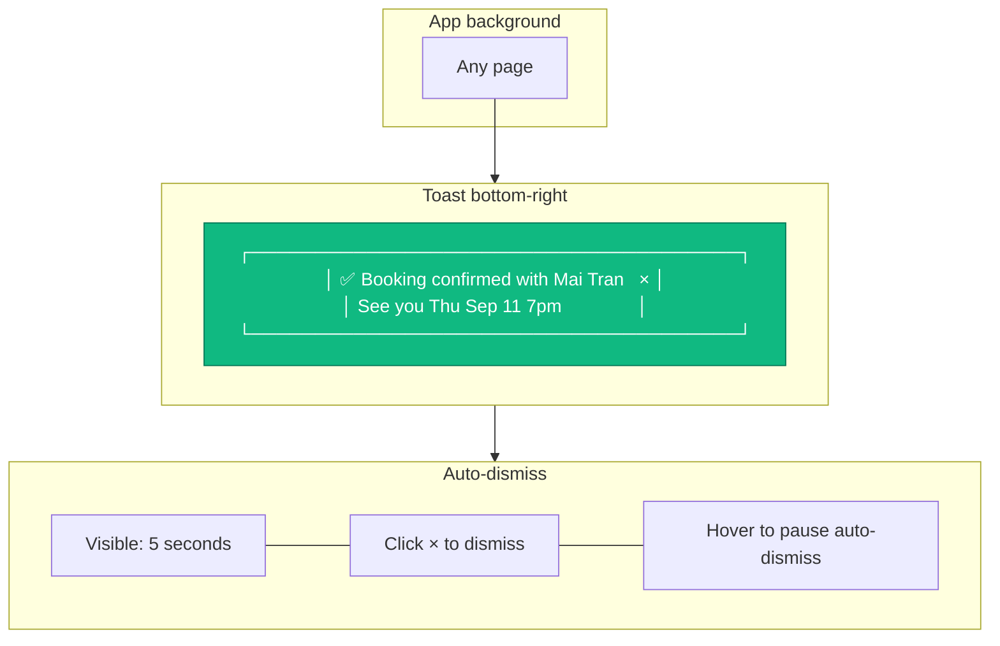

# Toast — Success

> **Mục đích:** Brief success notification bottom-right.

```mermaid
flowchart TB
    subgraph APP[App background]
        A[Any page]
    end

    subgraph TOAST[Toast bottom-right]
        T[┌──────────────────────────────────────┐<br/>│ ✅ Booking confirmed with Mai Tran   × │<br/>│ See you Thu Sep 11 7pm               │<br/>└──────────────────────────────────────┘]
    end

    subgraph AUTO[Auto-dismiss]
        AD1[Visible: 5 seconds]
        AD2[Click × to dismiss]
        AD3[Hover to pause auto-dismiss]
        AD1 --- AD2
        AD2 --- AD3
    end

    A --> TOAST
    TOAST --> AUTO

    classDef success fill:#10B981,stroke:#047857,color:#fff
    class T success
```

**Stack:** Multiple toasts stack vertically.
**A11y:** `role="status"`, `aria-live="polite"`.
