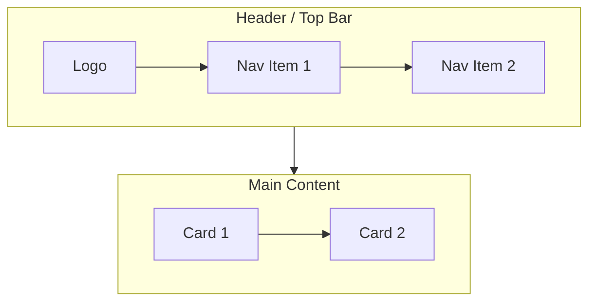

# SkillSeed — UI Mockups (Mermaid)

> **Mỗi screen của SkillSeed được mô tả bằng Mermaid flowchart.**
> Mỗi mockup nằm trong 1 file `.md` riêng, dùng cú pháp `flowchart` (TB/LR).
> **Render:** Mở file trong VS Code (extension Markdown Preview Mermaid), GitHub, hoặc [mermaid.live](https://mermaid.live).

---

## Conventions

### Cú pháp Mermaid chuẩn



### Ký hiệu

- `[Text]` — Box (button, input, card)
- `((Text))` — Circle (avatar, icon)
- `{(Text)}` — Rhombus (decision, conditional)
- `[/Text/]` — Parallelogram (input)
- `[\Text\]` — Trapezoid (output)
- `>` — Asymmetric shape (flag, callout)
- `[[Text]]` — Subroutine (modal, popup)
- `subgraph` — Section/component grouping
- `-->` — Arrow (flow direction)
- `-.->` — Dashed arrow (optional flow)
- `==>` — Thick arrow (primary flow)
- `:::className` — Styling (custom CSS)

### Class definitions (thêm ở đầu mỗi file nếu cần)

```mermaid
classDef primary fill:#10B981,stroke:#047857,color:#fff
classDef secondary fill:#6366F1,stroke:#4F46E5,color:#fff
classDef danger fill:#EF4444,stroke:#DC2626,color:#fff
classDef warning fill:#F59E0B,stroke:#D97706,color:#fff
classDef muted fill:#F3F4F6,stroke:#D1D5DB,color:#374151
```

---

## Tổng quan — 130+ screens

### Phase 0: Marketing & Auth (12 screens)
| # | Screen | File |
|---|--------|------|
| 1 | Landing Page | `00-marketing/01-landing.md` |
| 2 | Privacy Policy | `00-marketing/02-privacy.md` |
| 3 | Terms of Service | `00-marketing/03-terms.md` |
| 4 | Pricing (Public) | `00-marketing/04-pricing.md` |
| 5 | About Us | `00-marketing/05-about.md` |
| 6 | Blog List | `00-marketing/06-blog-list.md` |
| 7 | Blog Post | `00-marketing/07-blog-post.md` |
| 8 | Cookie Consent Banner | `00-marketing/08-cookie-banner.md` |
| 9 | Sign Up | `01-auth/01-signup.md` |
| 10 | Login | `01-auth/02-login.md` |
| 11 | Verify Email | `01-auth/03-verify-email.md` |
| 12 | Forgot/Reset Password | `01-auth/04-forgot-reset-password.md` |

### Phase 1: Onboarding (8 screens)
| # | Screen | File |
|---|--------|------|
| 13 | Welcome | `02-onboarding/01-welcome.md` |
| 14 | Skills I Can Teach | `02-onboarding/02-skills-teach.md` |
| 15 | Skills I Want to Learn | `02-onboarding/03-skills-learn.md` |
| 16 | Goals & Learning Style | `02-onboarding/04-goals-style.md` |
| 17 | Availability | `02-onboarding/05-availability.md` |
| 18 | Languages & Country | `02-onboarding/06-languages-country.md` |
| 19 | Avatar | `02-onboarding/07-avatar.md` |
| 20 | Onboarding Done | `02-onboarding/08-done.md` |

### Phase 1: Main App — Discover & Profile (5 screens)
| # | Screen | File |
|---|--------|------|
| 21 | Discover (Home) | `03-discover/01-discover.md` |
| 22 | Discover Filters | `03-discover/02-filters.md` |
| 23 | Search Results | `03-discover/03-search-results.md` |
| 24 | Public Profile | `06-profile/01-public-profile.md` |
| 25 | My Profile (Edit) | `06-profile/02-my-profile-edit.md` |

### Phase 1: Booking Flow (6 screens)
| # | Screen | File |
|---|--------|------|
| 26 | Booking Modal | `04-booking/01-booking-modal.md` |
| 27 | Booking Confirmation | `04-booking/02-booking-confirmation.md` |
| 28 | Bookings List | `04-booking/03-bookings-list.md` |
| 29 | Booking Detail | `04-booking/04-booking-detail.md` |
| 30 | Reschedule Booking | `04-booking/05-reschedule.md` |
| 31 | Cancel Booking | `04-booking/06-cancel.md` |

### Phase 1: Video Session (5 screens)
| # | Screen | File |
|---|--------|------|
| 32 | Video Call (Main) | `05-video-session/01-video-call.md` |
| 33 | Video Call + Chat Panel | `05-video-session/02-chat-panel.md` |
| 34 | Video Call + Whiteboard | `05-video-session/03-whiteboard.md` |
| 35 | Video Call + AI Notes | `05-video-session/04-ai-notes.md` |
| 36 | Session End / Rating Prompt | `05-video-session/05-session-end.md` |

### Phase 1: Rating & Wallet & Notif (6 screens)
| # | Screen | File |
|---|--------|------|
| 37 | Rating Modal (Multi-criteria) | `05-video-session/06-rating-modal.md` |
| 38 | Wallet Dashboard | `07-wallet/01-dashboard.md` |
| 39 | Wallet Transactions | `07-wallet/02-transactions.md` |
| 40 | Wallet Expiring Soon | `07-wallet/03-expiring.md` |
| 41 | Buy Seed Pack | `07-wallet/04-buy-seed-pack.md` |
| 42 | Notifications List | `08-notifications/01-list.md` |

### Phase 2-3: Premium & Marketplace (12 screens)
| # | Screen | File |
|---|--------|------|
| 43 | Premium Plans | `12-premium/01-plans.md` |
| 44 | Premium Comparison Table | `12-premium/02-comparison.md` |
| 45 | Checkout / Stripe | `12-premium/03-checkout.md` |
| 46 | Premium Success | `12-premium/04-success.md` |
| 47 | Subscription Management | `12-premium/05-manage-subscription.md` |
| 48 | Family Plan Setup | `12-premium/06-family-plan.md` |
| 49 | Marketplace (Expert List) | `13-marketplace/01-expert-list.md` |
| 50 | Expert Profile (Premium) | `13-marketplace/02-expert-profile.md` |
| 51 | Expert Payout Dashboard | `13-marketplace/03-expert-payout.md` |
| 52 | Creator Subscription Setup | `13-marketplace/04-creator-setup.md` |
| 53 | Subscriber Management | `13-marketplace/05-subscriber-mgmt.md` |
| 54 | NGO Gifting Portal | `13-marketplace/06-ngo-gifting.md` |

### Phase 3: Pods & Events (10 screens)
| # | Screen | File |
|---|--------|------|
| 55 | Pods Discover | `09-pods/01-discover.md` |
| 56 | Pod Detail | `09-pods/02-detail.md` |
| 57 | Create Pod | `09-pods/03-create.md` |
| 58 | Pod Forum | `09-pods/04-forum.md` |
| 59 | Pod Multi-Participant Session | `09-pods/05-multi-session.md` |
| 60 | Pod Analytics | `09-pods/06-analytics.md` |
| 61 | Events List | `10-events/01-list.md` |
| 62 | Event Detail | `10-events/02-detail.md` |
| 63 | Event Check-in | `10-events/03-checkin.md` |
| 64 | Events Map View | `10-events/04-map.md` |

### Phase 3: B2B Workspace (14 screens)
| # | Screen | File |
|---|--------|------|
| 65 | B2B Login (SSO) | `14-b2b/01-login-sso.md` |
| 66 | B2B Org Dashboard | `14-b2b/02-org-dashboard.md` |
| 67 | B2B Members List | `14-b2b/03-members.md` |
| 68 | B2B Member Detail | `14-b2b/04-member-detail.md` |
| 69 | B2B Invite Member | `14-b2b/05-invite.md` |
| 70 | B2B Skill Pool | `14-b2b/06-skill-pool.md` |
| 71 | B2B Internal Matching | `14-b2b/07-internal-match.md` |
| 72 | B2B Reports/Analytics | `14-b2b/08-reports.md` |
| 73 | B2B Skill Gap Heatmap | `14-b2b/09-heatmap.md` |
| 74 | B2B SSO Config | `14-b2b/10-sso-config.md` |
| 75 | B2B Audit Log | `14-b2b/11-audit-log.md` |
| 76 | B2B Billing | `14-b2b/12-billing.md` |
| 77 | B2B Settings (Org) | `14-b2b/13-org-settings.md` |
| 78 | B2B Export Report | `14-b2b/14-export.md` |

### Phase 3: Admin (12 screens)
| # | Screen | File |
|---|--------|------|
| 79 | Admin Dashboard | `15-admin/01-dashboard.md` |
| 80 | Admin Users List | `15-admin/02-users.md` |
| 81 | Admin User Detail | `15-admin/03-user-detail.md` |
| 82 | Admin Bookings List | `15-admin/04-bookings.md` |
| 83 | Admin Ratings Moderation | `15-admin/05-ratings.md` |
| 84 | Admin Skills Review | `15-admin/06-skills-review.md` |
| 85 | Admin Reports Queue | `15-admin/07-reports.md` |
| 86 | Admin Anomaly Detection | `15-admin/08-anomaly.md` |
| 87 | Admin Audit Log | `15-admin/09-audit.md` |
| 88 | Admin Settings | `15-admin/10-settings.md` |
| 89 | Admin Feature Flags | `15-admin/11-feature-flags.md` |
| 90 | Admin System Health | `15-admin/12-system-health.md` |

### Phase 4: Internationalization (5 screens)
| # | Screen | File |
|---|--------|------|
| 91 | Multi-region Landing (ID) | `00-marketing/09-landing-id.md` |
| 92 | Multi-region Landing (PH) | `00-marketing/10-landing-ph.md` |
| 93 | Locale Switcher | `11-settings/01-locale-switcher.md` |
| 94 | Multi-currency Display | `07-wallet/05-multi-currency.md` |
| 95 | Cross-border Matching | `03-discover/04-cross-border.md` |

### Phase 4: Blockchain (4 screens)
| # | Screen | File |
|---|--------|------|
| 96 | Skill Passport Detail | `06-profile/03-passport.md` |
| 97 | Connect Wallet | `11-settings/02-wallet.md` |
| 98 | SBT Mint Success | `06-profile/04-sbt-minted.md` |
| 99 | zk-Proof Verification | `06-profile/05-zk-verify.md` |

### Phase 5: Voice & AR/VR (10 screens)
| # | Screen | File |
|---|--------|------|
| 100 | Voice Wake Screen | `16-voice/01-wake.md` |
| 101 | Voice Conversation | `16-voice/02-conversation.md` |
| 102 | Voice History | `16-voice/03-history.md` |
| 103 | AR Session Launcher | `17-ar-vr/01-ar-launcher.md` |
| 104 | AR Yoga Overlay | `17-ar-vr/02-ar-yoga.md` |
| 105 | AR Cooking Overlay | `17-ar-vr/03-ar-cooking.md` |
| 106 | AR Repair Overlay | `17-ar-vr/04-ar-repair.md` |
| 107 | VR Avatar Lobby | `17-ar-vr/05-vr-lobby.md` |
| 108 | VR Whiteboard | `17-ar-vr/06-vr-whiteboard.md` |
| 109 | AI Coach Long-term | `16-voice/04-ai-coach.md` |

### Support & Help (5 screens)
| # | Screen | File |
|---|--------|------|
| 110 | Help Center / FAQ | `18-support/01-faq.md` |
| 111 | Contact Support | `18-support/02-contact.md` |
| 112 | Report a Problem | `18-support/03-report.md` |
| 113 | Bug Report Form | `18-support/04-bug-report.md` |
| 114 | Feedback Widget | `18-support/05-feedback-widget.md` |

### Account & Settings (10 screens)
| # | Screen | File |
|---|--------|------|
| 115 | Settings Home | `11-settings/03-home.md` |
| 116 | Account Settings | `11-settings/04-account.md` |
| 117 | Notification Settings | `11-settings/05-notifications.md` |
| 118 | Privacy Settings | `11-settings/06-privacy.md` |
| 119 | Connected Calendars | `11-settings/07-calendars.md` |
| 120 | Wallet Connected (Web3) | `11-settings/08-web3.md` |
| 121 | Blocked Users | `11-settings/09-blocked.md` |
| 122 | Data Export (GDPR) | `11-settings/10-data-export.md` |
| 123 | Delete Account | `11-settings/11-delete-account.md` |
| 124 | Sessions & Devices | `11-settings/12-devices.md` |

### Special States (10+ screens)
| # | Screen | File |
|---|--------|------|
| 125 | Empty State — Discover | `99-special-states/01-empty-discover.md` |
| 126 | Empty State — Bookings | `99-special-states/02-empty-bookings.md` |
| 127 | Empty State — Wallet | `99-special-states/03-empty-wallet.md` |
| 128 | Empty State — Notifications | `99-special-states/04-empty-notif.md` |
| 129 | Loading Skeleton — Discover | `99-special-states/05-loading-discover.md` |
| 130 | Loading Skeleton — Profile | `99-special-states/06-loading-profile.md` |
| 131 | Error 404 | `99-special-states/07-404.md` |
| 132 | Error 500 | `99-special-states/08-500.md` |
| 133 | Offline Mode | `99-special-states/09-offline.md` |
| 134 | Maintenance Mode | `99-special-states/10-maintenance.md` |
| 135 | Success Toast | `99-special-states/11-toast-success.md` |
| 136 | Error Toast | `99-special-states/12-toast-error.md` |

---

## Quy ước đặt tên file

```
{category}/{NN}-{screen-name}.md
```

- **NN** = Số thứ tự 2 chữ số (01, 02, ...)
- **screen-name** = kebab-case, ngắn gọn

## Cách render

1. **VS Code:** Cài extension "Markdown Preview Mermaid Support", mở file → preview
2. **GitHub:** Push lên repo, mở file .md trên GitHub → mermaid auto-render
3. **Online:** Copy nội dung mermaid vào [mermaid.live](https://mermaid.live)
4. **Export PNG:** Trên mermaid.live → tab "Actions" → Export PNG/SVG

## Trạng thái triển khai

- ✅ **Done:** Screen đã có Mermaid mockup đầy đủ
- 🚧 **Stub:** Screen đã có file nhưng chỉ có placeholder, cần triển khai sau
- ❌ **Pending:** Screen chưa có file

Xem chi tiết trong từng file `.md` ở folder tương ứng.