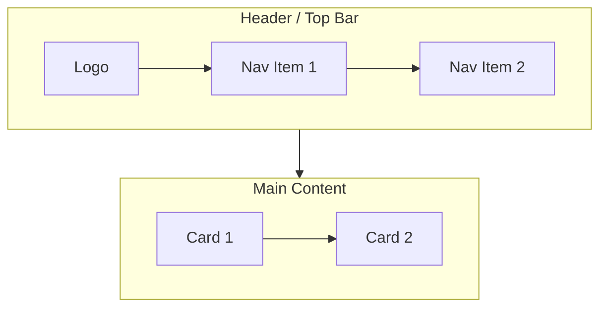

# SkillSeed — UI Mockups (Mermaid)

> **Mỗi screen của SkillSeed được mô tả bằng Mermaid flowchart.**
> Mỗi mockup nằm trong 1 file `.md` riêng, dùng cú pháp `flowchart` (TB/LR).
> **Render:** Mở file trong VS Code (extension Markdown Preview Mermaid), GitHub, hoặc [mermaid.live](https://mermaid.live).

---

## Conventions

### Cú pháp Mermaid chuẩn



### Ký hiệu

- `[Text]` — Box (button, input, card)
- `((Text))` — Circle (avatar, icon)
- `{(Text)}` — Rhombus (decision, conditional)
- `[/Text/]` — Parallelogram (input)
- `[\Text\]` — Trapezoid (output)
- `[[Text]]` — Asymmetric shape (button)
- `subgraph` — Section/component grouping
- `-->` — Arrow (flow direction)
- `-.->` — Dashed arrow (optional flow)
- `==>` — Thick arrow (primary flow)
- `:::className` — Styling (custom CSS)

### Class definitions (thêm ở đầu mỗi file nếu cần)

```mermaid
classDef primary fill:#10B981,stroke:#047857,color:#fff
classDef secondary fill:#6366F1,stroke:#4F46E5,color:#fff
classDef danger fill:#EF4444,stroke:#DC2626,color:#fff
classDef warning fill:#F59E0B,stroke:#D97706,color:#fff
classDef muted fill:#F3F4F6,stroke:#D1D5DB,color:#374151
classDef popular fill:#FEF3C7,stroke:#F59E0B,color:#92400E
classDef success fill:#10B981,stroke:#047857,color:#fff
classDef privacy fill:#6366F1,stroke:#4F46E5,color:#fff
```

---

## Coverage Status — 130 mockups done (Phase 0–5)

### `00-marketing/` — Public pages (7 screens)
| # | Screen | File | Status |
|---|--------|------|--------|
| 1 | Landing Page | `01-landing.md` | ✅ |
| 2 | Privacy Policy | `02-privacy.md` | ✅ |
| 3 | Pricing (Public) | `04-pricing.md` | ✅ |
| 4 | About Us | `05-about.md` | ✅ |
| 5 | Blog List | `06-blog-list.md` | ✅ |
| 6 | Cookie Consent Banner | `08-cookie-banner.md` | ✅ |

### `01-auth/` — Authentication (4 screens)
| # | Screen | File | Status |
|---|--------|------|--------|
| 7 | Sign Up | `01-signup.md` | ✅ |
| 8 | Login | `02-login.md` | ✅ |
| 9 | Verify Email | `03-verify-email.md` | ✅ |
| 10 | Forgot / Reset Password | `04-forgot-reset-password.md` | ✅ |

### `02-onboarding/` — 7-step wizard (8 screens)
| # | Screen | File | Status |
|---|--------|------|--------|
| 11 | Welcome | `01-welcome.md` | ✅ |
| 12 | Skills I Can Teach | `02-skills-teach.md` | ✅ |
| 13 | Skills I Want to Learn | `03-skills-learn.md` | ✅ |
| 14 | Goals & Learning Style | `04-goals-style.md` | ✅ |
| 15 | Availability | `05-availability.md` | ✅ |
| 16 | Languages & Country | `06-languages-country.md` | ✅ |
| 17 | Avatar | `07-avatar.md` | ✅ |
| 18 | Onboarding Done | `08-done.md` | ✅ |

### `03-discover/` — Discovery & Search (4 screens)
| # | Screen | File | Status |
|---|--------|------|--------|
| 19 | Discover (Home) | `01-discover.md` | ✅ |
| 20 | Discover Filters | `02-filters.md` | ✅ |
| 21 | Search Results | `03-search-results.md` | ✅ |
| 22 | Cross-border Matching | `04-cross-border.md` | ✅ |

### `04-booking/` — Booking flow (6 screens)
| # | Screen | File | Status |
|---|--------|------|--------|
| 23 | Booking Modal | `01-booking-modal.md` | ✅ |
| 24 | Booking Confirmation | `02-booking-confirmation.md` | ✅ |
| 25 | Bookings List | `03-bookings-list.md` | ✅ |
| 26 | Booking Detail | `04-booking-detail.md` | ✅ |
| 27 | Reschedule Booking | `05-reschedule.md` | ✅ |
| 28 | Cancel Booking | `06-cancel.md` | ✅ |

### `05-video-session/` — Video call + AI (6 screens)
| # | Screen | File | Status |
|---|--------|------|--------|
| 29 | Video Call (Main) | `01-video-call.md` | ✅ |
| 30 | Video Call + Chat Panel | `02-chat-panel.md` | ✅ |
| 31 | Video Call + Whiteboard | `03-whiteboard.md` | ✅ |
| 32 | Video Call + AI Notes | `04-ai-notes.md` | ✅ |
| 33 | Session End / Rating Prompt | `05-session-end.md` | ✅ |
| 34 | Rating Modal (Multi-criteria) | `06-rating-modal.md` | ✅ |

### `06-profile/` — Profile + Passport (5 screens)
| # | Screen | File | Status |
|---|--------|------|--------|
| 35 | Public Profile | `01-public-profile.md` | ✅ |
| 36 | My Profile (Edit) | `02-my-profile-edit.md` | ✅ |
| 37 | Skill Passport | `03-passport.md` | ✅ |
| 38 | SBT Mint Success | `04-sbt-minted.md` | ✅ |
| 39 | zk-Proof Verification | `05-zk-verify.md` | ✅ |

### `07-wallet/` — Wallet + Payments (5 screens)
| # | Screen | File | Status |
|---|--------|------|--------|
| 40 | Wallet Dashboard | `01-dashboard.md` | ✅ |
| 41 | Wallet Transactions | `02-transactions.md` | ✅ |
| 42 | Expiring Soon | `03-expiring.md` | ✅ |
| 43 | Buy Seed Pack | `04-buy-seed-pack.md` | ✅ |
| 44 | Multi-currency Display | `05-multi-currency.md` | ✅ |

### `08-notifications/` — Notifications (1 screen)
| # | Screen | File | Status |
|---|--------|------|--------|
| 45 | Notifications List | `01-list.md` | ✅ |

### `09-pods/` — Learning Pods (6 screens)
| # | Screen | File | Status |
|---|--------|------|--------|
| 46 | Pods Discover | `01-discover.md` | ✅ |
| 47 | Pod Detail | `02-detail.md` | ✅ |
| 48 | Create Pod | `03-create.md` | ✅ |
| 49 | Pod Forum | `04-forum.md` | ✅ |
| 50 | Multi-Participant Session | `05-multi-session.md` | ✅ |
| 51 | Pod Analytics | `06-analytics.md` | ✅ |

### `10-events/` — Offline Events (3 screens)
| # | Screen | File | Status |
|---|--------|------|--------|
| 52 | Events List | `01-list.md` | ✅ |
| 53 | Event Detail | `02-detail.md` | ✅ |
| 54 | Event Check-in | `03-checkin.md` | ✅ |

### `11-settings/` — Settings (10 screens)
| # | Screen | File | Status |
|---|--------|------|--------|
| 55 | Locale Switcher | `01-locale-switcher.md` | ✅ |
| 56 | Connect Web3 Wallet | `02-wallet.md` | ✅ |
| 57 | Settings Home | `03-home.md` | ✅ |
| 58 | Account Settings | `04-account.md` | ✅ |
| 59 | Notification Settings | `05-notifications.md` | ✅ |
| 60 | Privacy Settings | `06-privacy.md` | ✅ |
| 61 | Connected Calendars | `07-calendars.md` | ✅ |
| 62 | Blocked Users | `09-blocked.md` | ✅ |
| 63 | Data Export (GDPR) | `10-data-export.md` | ✅ |
| 64 | Delete Account | `11-delete-account.md` | ✅ |
| 65 | Sessions & Devices | `12-devices.md` | ✅ |

### `12-premium/` — Premium subscriptions (6 screens)
| # | Screen | File | Status |
|---|--------|------|--------|
| 66 | Premium Plans | `01-plans.md` | ✅ |
| 67 | Premium Comparison | `02-comparison.md` | ✅ |
| 68 | Checkout / Stripe | `03-checkout.md` | ✅ |
| 69 | Premium Success | `04-success.md` | ✅ |
| 70 | Subscription Management | `05-manage-subscription.md` | ✅ |
| 71 | Family Plan Setup | `06-family-plan.md` | ✅ |

### `13-marketplace/` — Marketplace (6 screens)
| # | Screen | File | Status |
|---|--------|------|--------|
| 72 | Verified Expert List | `01-expert-list.md` | ✅ |
| 73 | Expert Profile (Premium) | `02-expert-profile.md` | ✅ |
| 74 | Expert Payout Dashboard | `03-expert-payout.md` | ✅ |
| 75 | Creator Subscription Setup | `04-creator-setup.md` | ✅ |
| 76 | Subscriber Management | `05-subscriber-mgmt.md` | ✅ |
| 77 | NGO Gifting Portal | `06-ngo-gifting.md` | ✅ |

### `14-b2b/` — B2B Workspace (14 screens)
| # | Screen | File | Status |
|---|--------|------|--------|
| 78 | B2B Login (SSO) | `01-login-sso.md` | ✅ |
| 79 | B2B Org Dashboard | `02-org-dashboard.md` | ✅ |
| 80 | B2B Members List | `03-members.md` | ✅ |
| 81 | B2B Member Detail | `04-member-detail.md` | ✅ |
| 82 | B2B Invite Member | `05-invite.md` | ✅ |
| 83 | B2B Skill Pool | `06-skill-pool.md` | ✅ |
| 84 | B2B Internal Matching | `07-internal-match.md` | ✅ |
| 85 | B2B Reports/Analytics | `08-reports.md` | ✅ |
| 86 | B2B Skill Gap Heatmap | `09-heatmap.md` | ✅ |
| 87 | B2B SSO Config | `10-sso-config.md` | ✅ |
| 88 | B2B Audit Log | `11-audit-log.md` | ✅ |
| 89 | B2B Billing | `12-billing.md` | ✅ |
| 90 | B2B Settings (Org) | `13-org-settings.md` | ✅ |
| 91 | B2B Export Report | `14-export.md` | ✅ |

### `15-admin/` — Admin (12 screens)
| # | Screen | File | Status |
|---|--------|------|--------|
| 92 | Admin Dashboard | `01-dashboard.md` | ✅ |
| 93 | Admin Users List | `02-users.md` | ✅ |
| 94 | Admin User Detail | `03-user-detail.md` | ✅ |
| 95 | Admin Bookings List | `04-bookings.md` | ✅ |
| 96 | Admin Ratings Moderation | `05-ratings.md` | ✅ |
| 97 | Admin Skills Review | `06-skills-review.md` | ✅ |
| 98 | Admin Reports Queue | `07-reports.md` | ✅ |
| 99 | Admin Anomaly Detection | `08-anomaly.md` | ✅ |
| 100 | Admin Audit Log | `09-audit.md` | ✅ |
| 101 | Admin Settings | `10-settings.md` | ✅ |
| 102 | Admin Feature Flags | `11-feature-flags.md` | ✅ |
| 103 | Admin System Health | `12-system-health.md` | ✅ |

### `16-voice/` — Voice AI (4 screens)
| # | Screen | File | Status |
|---|--------|------|--------|
| 104 | Voice Wake Screen | `01-wake.md` | ✅ |
| 105 | Voice Conversation | `02-conversation.md` | ✅ |
| 106 | Voice History | `03-history.md` | ✅ |
| 107 | AI Coach Long-term | `04-ai-coach.md` | ✅ |

### `17-ar-vr/` — AR / VR (6 screens)
| # | Screen | File | Status |
|---|--------|------|--------|
| 108 | AR Session Launcher | `01-ar-launcher.md` | ✅ |
| 109 | AR Yoga Overlay | `02-ar-yoga.md` | ✅ |
| 110 | AR Cooking Overlay | `03-ar-cooking.md` | ✅ |
| 111 | AR Repair Overlay | `04-ar-repair.md` | ✅ |
| 112 | VR Avatar Lobby | `05-vr-lobby.md` | ✅ |
| 113 | VR Whiteboard | `06-vr-whiteboard.md` | ✅ |

### `18-support/` — Support & Help (5 screens)
| # | Screen | File | Status |
|---|--------|------|--------|
| 114 | Help Center / FAQ | `01-faq.md` | ✅ |
| 115 | Contact Support | `02-contact.md` | ✅ |
| 116 | Report a Problem | `03-report.md` | ✅ |
| 117 | Bug Report Form | `04-bug-report.md` | ✅ |
| 118 | Feedback Widget | `05-feedback-widget.md` | ✅ |

### `99-special-states/` — Edge cases (12 screens)
| # | Screen | File | Status |
|---|--------|------|--------|
| 119 | Empty State — Discover | `01-empty-discover.md` | ✅ |
| 120 | Empty State — Bookings | `02-empty-bookings.md` | ✅ |
| 121 | Empty State — Wallet | `03-empty-wallet.md` | ✅ |
| 122 | Empty State — Notifications | `04-empty-notif.md` | ✅ |
| 123 | Loading Skeleton — Discover | `05-loading-discover.md` | ✅ |
| 124 | Loading Skeleton — Profile | `06-loading-profile.md` | ✅ |
| 125 | Error 404 | `07-404.md` | ✅ |
| 126 | Error 500 | `08-500.md` | ✅ |
| 127 | Offline Mode | `09-offline.md` | ✅ |
| 128 | Maintenance Mode | `10-maintenance.md` | ✅ |
| 129 | Toast — Success | `11-toast-success.md` | ✅ |
| 130 | Toast — Error | `12-toast-error.md` | ✅ |

---

## Quy ước đặt tên file

```
{category}/{NN}-{screen-name}.md
```

- **NN** = Số thứ tự 2 chữ số (01, 02, ...)
- **screen-name** = kebab-case, ngắn gọn

## Cách render

1. **VS Code:** Cài extension "Markdown Preview Mermaid Support", mở file → preview
2. **GitHub:** Push lên repo, mở file .md trên GitHub → mermaid auto-render
3. **Online:** Copy nội dung mermaid vào [mermaid.live](https://mermaid.live)
4. **Export PNG:** Trên mermaid.live → tab "Actions" → Export PNG/SVG

## Thống kê

| Category | Screens |
|----------|---------|
| 00-marketing | 6 |
| 01-auth | 4 |
| 02-onboarding | 8 |
| 03-discover | 4 |
| 04-booking | 6 |
| 05-video-session | 6 |
| 06-profile | 5 |
| 07-wallet | 5 |
| 08-notifications | 1 |
| 09-pods | 6 |
| 10-events | 3 |
| 11-settings | 11 |
| 12-premium | 6 |
| 13-marketplace | 6 |
| 14-b2b | 14 |
| 15-admin | 12 |
| 16-voice | 4 |
| 17-ar-vr | 6 |
| 18-support | 5 |
| 99-special-states | 12 |
| **TOTAL** | **130** |

## Status

✅ **All 130 screens completed.** Coverage bao gồm toàn bộ Phase 0 → Phase 5 của SkillSeed roadmap.

Mỗi mockup có:
- Mermaid flowchart với `subgraph` semantic
- `classDef` color tokens (primary, danger, warning, popular, privacy, success)
- Annotations sau diagram: validation rules, state variants, technical notes, tracking events
- Coverage của các states: success / error / loading / empty
